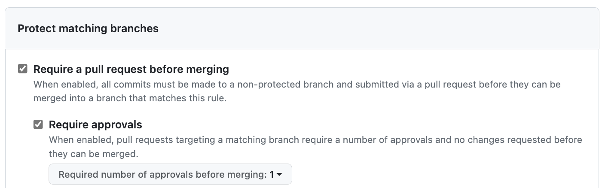

# Overview 

This activity is designed to teach both basic and advanced features of Git and GitHub.

# Introduction 

Do Part 1 by yourself and work with a partner on Part 2. 

# Part 1: Git Basics

Start by creating a folder named **apollo**, navigate into it, and initialize a local Git repository. 

```
mkdir apollo
cd apollo
git init
```

**git init** creates a new Git repository. Verify that a hidden directory named **.git** has been created.

```
ls .git
```

Next, create a Python script named **doit.py** with the following content: 

```
def isEven(number): 
    return number % 2 == 0

if __name__ == "__main__":
    if isEven(10):
        print('Even!')
    else:
        print('Odd!')
```

Suppose we want to add **doit.py** to Git's version control system under the apollo project. Follow these steps:

```
git add doit.py
```

Now the **doit.py** script is staged—meaning it's ready to be included in the next commit. Run the following command to list all staged files. 

```
git diff --name-only --cached
```

Now let's run the following command to create a new version of the repository that includes the newly staged **doit.py** file."

```
git commit -m "creation of doit.py" 
```

Let’s tag this version as v0.1. Keep in mind that tagging commits is optional, but it can help mark important milestones in your project.

```
git tag v0.1
```

Use the following command to view a summary of all actions performed so far.

```
git log
```

You can also get a summary using: 

```
git log --oneline
```

At this point, verify that no files are currently staged for commit.

```
git diff --name-only --cached
```

Proceed by making a change to **doit.py** as described below.. 

```
def isEven(number): 
    return number % 2 == 0

def isOdd(number): 
    return not isEven(number)

if __name__ == "__main__":
    if isEven(10):
        print('Even!')
    else:
        print('Odd!')
```

Let’s stage **doit.py** again by running git add, followed by a commit and a tag.

```
git add doit.py
git commit -m "updates on doit.py"
git tag v0.2
```

If you run git log --oneline, you should see that HEAD points to version v0.2, and that the previous version was v0.1.

Now let's learn how to revert to a previous version using the checkout command by specifying the desired version name.

```
git checkout "v0.1"
```

If you take a look at **doit.py** now, you should see the original version of the script. To return to the current version (v0.2), use the checkout command again, specifying the version name. 

```
git checkout "v0.2"
```

Make sure that **doit.py** now reflects the latest updates. Next, let’s explore Git branching. Use the following command to check the name of your current branch. 

```
git branch
```

"main" is the default branch name. We use branching whenever we want to experiment with changes before deciding to incorporate them into the main version of the repository. Let’s create a new branch called "testing".

```
git branch testing 
```

That command only creates the "testing" branch but it doesn't change the current branch to it. You need to run git's "checkout" command for that. 

```
git checkout testing
```

In the future you can run both commands in one step by using: 

```
git checkout -b testing
```

Now modify **doit.py** with the following. 

```
from random import randrange

def isEven(number): 
    return number % 2 == 0

def isOdd(number): 
    return not isEven(number)

if __name__ == "__main__":
    number = randrange(100)
    if isEven(number):
        print(f'{number} is even!')
    else:
        print(f'{number} is odd!')
```

Add and commit the changes that you made on **doit.py**. 

```
git add doit.py
git commit -m "+updates to doit.py"
```

Next, go back to the "main" branch. 

```
git checkout main
```

Finally, let’s merge the "testing" branch into "main", and tag the resulting commit as v0.3. 

```
git merge testing
git tag "v0.3"
```

Run git log --oneline again to visualize the commit history, including those made on different branches.

As an exercise, switch to version v0.1 and check the state of **doit.py**. Then, repeat the process for version v0.2, and finally return to the latest version, v0.3.

# Part 2: Working Cooperatively

In this part, you will work with a partner. From now on, partners will be referred to as PA and PB. PA should create a remote repository on GitHub named **hera**, then clone the newly created repository to their local machine.

```
git clone https://github.com/<account>/hera
cd hera
```

Next, PA should navigate to the repository’s GitHub settings, go to Access > Collaborators, and add PB as a collaborator. PB must then accept the invitation to collaborate on the **hera** repository.

To initialize the main branch, PA should make the first commit by creating a README.md file with the following content: 

```
# Project HERA

This is project **hera**!
```

Add the file to the repository and commit the change, also updating the remote. 

```
git add README.md
git commit -m "main branch kick-off"
git push origin main
```

PA should now create and commit a "dev" branch to host unstable versions of the project. The default "main" branch will be reserved for stable, production-ready code.

```
git branch dev
git checkout dev
git commit --allow-empty -m "Creation of the dev branch"
git push origin dev
```

"origin" refers to the remote repository, and "dev" is the name of the development branch on that remote. At this point, if you visit the GitHub repository, you should see two branches: "main" and "dev".

Next, PA should protect the "main" branch on GitHub using the following settings:



Now let's simulate a "sprint" development cycle.  PA and PB will simulatenously work on features "feature_a" and "feature_b", respectively.

PA should do: 

```
git branch feature_a
git checkout feature_a
```

Next, PA should add the file **src/feature_a.py** with the following content:  

```
print('This is the amazing feature A!')
print('Have a nice day!')
```

Next, PA should create and commit to a new branch named "f"eature_a. Once the work is complete, merge "feature_a" into the local "dev" branch. After merging, PA should wait and ensure that PB has also completed work on their respective feature before proceeding further.

```
git add src/feature_a.py
git commit -m "feature a updates"
git checkout dev
git merge feature_a
```

Have PB clone the repository, and create their local "dev" and "feature_b" branches. 

```
git clone https://github.com/<account>/hera
git branch dev
git checkout dev
git branch feature_b
git checkout feature_b
```

Have PB add the file **src/feature_b.py** with the following content: 

```
print('This is the amazing feature B!')
print('Have a nice day!')
```

Have PB add and commit to "feature_b" branch, followed by a merge to local "dev". 

```
git add src/feature_b.py
git commit -m "feature b updates"
git checkout dev
git merge feature_b
```

Now that PB has had time to catch up, PA should perform a local merge with the remote repository, followed by a remote update.

Since PA cannot determine whether the local dev branch has diverged from the remote version, it's important to first synchronize with the remote before pushing any changes. To do this:

```
git config pull.rebase false
git pull origin dev
git push origin dev
```

At this point, PB's local version of the remote "dev" branch has diverged. PB now has two options to resolve this divergence: merging or rebasing. Since PA has already demonstrated the merge approach, let's have PB proceed with a rebase.

Keep in mind that rebasing is a destructive operation—PB will lose some of its commit history. Currently, PB's history includes two commits: the initial "main" branch setup and the updates to "feature B".

To perform the rebase, PB should follow these steps:

```
git config pull.rebase true
git pull origin dev
git push origin dev
```

Now if PB checks its commit history using "git log" it should see: "main branch kick-off", "creation of the dev branch", "feature a updates", and "feature b updates". 

# Pull Request

If you refresh the GitHub repository page for project **hera**, you’ll notice that the "main" branch remains unchanged—it still contains only the README.md file and no feature updates.

Switch to the "dev" branch, and GitHub will display a “Compare & pull request” button. Click this button, enter the message “features a and b”, and confirm the pull request.

Since the "main" branch is protected, the pull request must be approved by at least one collaborator. Because PA initiated the request, only PB is eligible to approve it.

Next, have PB perform a code review, followed by approval of the pull request, which will merge the changes from "dev" into "main".
